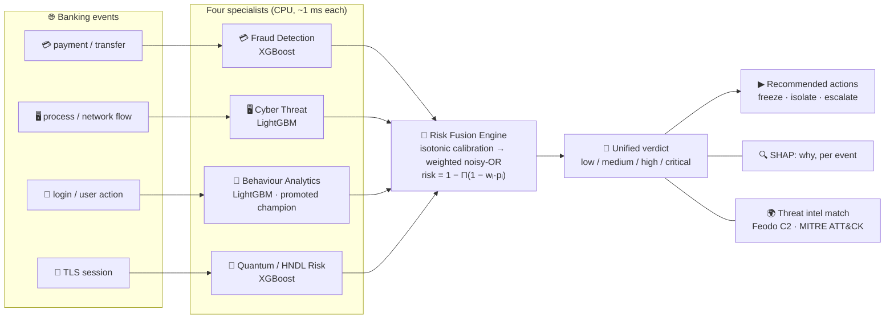
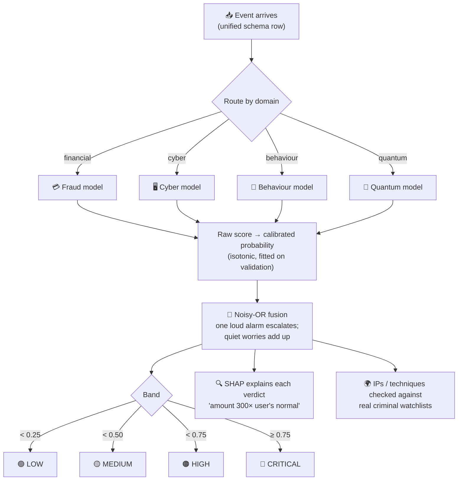
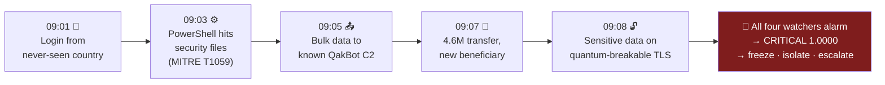
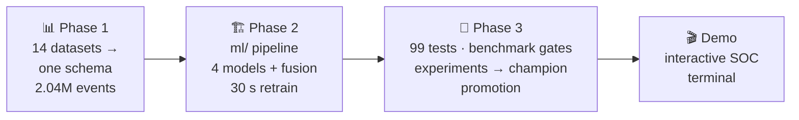
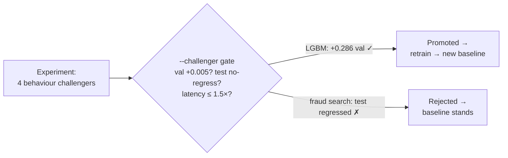

# 🛡️ Sentinel Fusion AI

**One AI brain that watches money, machines, people and the post-quantum future — and fuses what it sees into a single explainable threat verdict, in under 100 milliseconds.**

```bash
.venv/bin/python sentinel_demo.py     # ← the whole project, live in your terminal
```

---

## 1. Why we built it

Banks run **separate** defense teams. The fraud team sees a big transfer. The security team sees a strange program. The identity team sees an odd login. **Each alone looks minor — nobody sees the whole attack.**

Real attacks are chains: *steal a password → break into the machine → siphon data → move the money out.* By the time humans connect those dots across four dashboards, the money is gone.

And a new threat is already here: criminals **steal encrypted data today** to crack it with **quantum computers tomorrow** ("harvest now, decrypt later"). Almost nobody watches for it.

**Sentinel Fusion AI closes both gaps**: four specialist models watch the four fronts simultaneously, and a fusion engine combines their opinions into one verdict — with plain-language reasons for every decision.

## 2. What we built

Four trained specialists, one Command Center, full explainability, real threat-feed correlation — wrapped in an interactive terminal SOC experience.



Trained on a **unified corpus of 2,043,664 events** built from **14 public datasets** across 5 domains (UNSW-NB15, BETH, CIC-IDS2017, credit-card fraud, PaySim, Bank Account Fraud, RBA logins, CERT insider, URLhaus, MITRE ATT&CK, CISA KEV, Feodo, malicious URLs, quantum-synthetic) — all mapped to **one event schema** so one pipeline trains everything.

## 3. How it works — one event, start to finish



The demo plays this on a real attack chain — every prediction from the trained models, nothing staged:



Contrast case ships too: a routine card payment → **LOW 0.0008, no watchlist match** — the AI stays quiet when nothing is wrong.

## 4. How we built it — the journey



**Phase 1 — data.** Cleaned 14 raw datasets, mapped everything onto one event schema (`docs/unified_schema.md`), engineered **leakage-safe, past-only features** (every historical aggregate excludes the current row), validated the 2.04M-row corpus.

**Phase 2 — models.** Modular `ml/` package (config / data / features / train / evaluate / explain / fusion). **Per-source temporal split** 70/15/15 — models are always tested on events from *after* their training window, per dataset. Serialized both joblib bundles and pickle-free native boosters, with score-parity tests between them. Full retrain: **~30 seconds** on a laptop CPU.

**Phase 3 — prove it, then improve it.**
- **99-test pytest suite**: unit math checks (fusion noisy-OR closed-form, band boundaries), leakage guards, model-quality floors, serialization round-trips, latency SLAs — running on a committed 1.4 MB data fixture.
- **Benchmark harness with a regression gate**: `python -m ml.benchmark --check` fails the build if any metric drops below the committed baseline.
- **Bounded experiments with gated promotion** — no cherry-picking; challengers must beat the champion on validation AND test AND latency:



**Honest wins and honest losses:**
- 🏆 Behaviour model **0.584 → 0.817 ROC-AUC** (supervised LightGBM beat IsolationForest, LOF, ECOD) → fusion rose **0.958 → 0.972**.
- ❌ Fraud 24-config search **lost on test** (PR-AUC 0.526 < 0.536) — rejected, documented, baseline kept.
- 🐛 Caught our own leak: `event_subtype` carried the attack-category name for two datasets → cyber scored a fake 1.000. Scrubbed at load, pinned by tests. `severity` (label-derived) excluded everywhere.

## 5. Benchmark results

Test split (per-source temporal, unseen 306,556 events), threshold = max-F1 on validation. Reproduce: `python -m ml.benchmark`. Committed floors: `benchmarks/baselines/metrics_baseline.json`.

| Model | Library | ROC-AUC | PR-AUC | F1 | Precision | Recall | 1-row p50 | Batch rows/s |
|---|---|---:|---:|---:|---:|---:|---:|---:|
| Fraud Detection | XGBoost | 0.838 | 0.536 | 0.498 | 0.510 | 0.486 | 1.4 ms | 1.9 M |
| Cyber Threat | LightGBM | 0.998 | 0.996 | 0.962 | 0.955 | 0.969 | 0.8 ms | 1.7 M |
| Behaviour Analytics | LightGBM | **0.817** | 0.792 | 0.829 | 0.733 | 0.953 | 0.7 ms | 8.7 M |
| Quantum Risk | XGBoost | 1.000 | 1.000 | 0.996 | 0.992 | 1.000 | 1.4 ms | 3.0 M |
| **Risk Fusion (cross-domain)** | — | **0.972** | — | — | — | — | — | 955 K fused |

Reading guide:
- Quantum ≈ 1.0 **by design** — its label is a documented deterministic HNDL rule; the model is rule-recovery/schema sanity, and a drop signals data breakage.
- Fraud is the hard problem (4.2% positives, three very different sources); population-cost threshold analysis (c_fn = 20×c_fp → t = 0.764) in `reports/ml/experiments/fraud_search.json`.
- Calibration: isotonic beat Platt sigmoid on Brier for all four models; fusion weight refit gained only +0.0009 AUC — not adopted. Everything above is reproducible with seed 42.

## 6. 🎬 The demo — what judges see

Interactive menu, plain language, zero jargon required:

```
What would you like to see?
 1  🚨  Watch a live attack get caught
 2  ✅  Watch a normal customer sail through
 3  🧠  Meet the AI team — who watches what
 4  🔍  Step through the attack, one event at a time
 5  📊  Report card — how good is this AI really?
 6  🚪  Exit
```

- **1 / 2** — the full SOC story auto-played: loading, incoming events, feature extraction, model routing, fusion diagram, SHAP explanations, threat-intel matches, attack timeline, incident report, performance metrics.
- **3** — the models as plain-language specialists: Money Watcher 💳, Intrusion Watcher 🖥️, Habits Watcher 👤, Future-Proofing Watcher 🔐, and the Command Center 🧠.
- **4** — presenter mode: press Enter to advance event by event; each shows *what happened*, a 0–100 suspicion meter, the verdict, decision time, and **why in human sentences** ("This transfer is far outside this customer's normal range", "destination = known QakBot criminal server").
- **5** — quality as a plain report card ("catches 97 of every 100 real cases"), read from the saved test metrics.

Honesty contract: event data is simulated **from real labeled test rows** (`demo/build_scenarios.py`); every probability, SHAP value and watchlist hit is computed live by the trained artifacts. Predictions are never faked.

Classic non-interactive runs (recordings/CI): `--all`, `--scenario attack|benign`, `--fast`, `--no-color`.

## 7. Setup & commands

```bash
python3.12 -m venv .venv
source .venv/bin/activate
pip install -r requirements.txt      # or: pip install -e .[train,dev]
```

The demo needs `models/` (regenerates in ~30 s, below) and `demo/scenarios.parquet` (committed). Full retraining needs `data/unified/*.parquet` from Phase 1.

```bash
.venv/bin/python sentinel_demo.py              # the demo (interactive menu)
.venv/bin/python -m ml.run_pipeline            # retrain all 4 models + fusion (~30 s)
.venv/bin/pytest                               # fast tier: 59 tests, <5 s, no big data
.venv/bin/pytest -m ""                         # everything incl. slow/quality/perf (99 tests)
.venv/bin/python -m ml.benchmark               # measure + append history
.venv/bin/python -m ml.benchmark --check       # regression gate (exit 1 on breach)
.venv/bin/python -m ml.benchmark --challenger models/challengers/X.joblib --model KEY
make test | test-all | gates | bench | experiments | lint   # shortcuts
```

## 8. Repo layout

```
ml/               training pipeline + benchmark + experiments
demo/             SOC demo: engine, plain-language layer, interactive menu, scenarios
sentinel_demo.py  demo entry point
tests/            99-test suite (unit/integration/quality/perf) + committed mini fixture
benchmarks/       committed baseline floors + run history (JSONL)
models/           trained bundles + native boosters (gitignored, regenerate in ~30 s)
reports/ml/       metrics, SHAP plots, fusion report, experiments, MODELS.md
data/, notebooks/, docs/, reports/   Phase 1 (below)
```

## 9. Phase 1 — dataset collection & preprocessing

```
data/raw/         raw downloads (gitignored): cyber, financial, behaviour, threat_intel
data/clean/       cleaned per-dataset parquet
data/unified/     part_*.parquet + unified_events.parquet + unified_events_engineered.parquet
notebooks/        01-13 preprocessing/unify/features/validation notebooks
notebooks/src/    percent-format sources (python notebooks/_make_nb.py regenerates .ipynb)
docs/             unified_schema.md, data_dictionary.md
reports/          per-dataset stats, EDA figures, validation_report.{json,md}
```

Run order: 01→10 (any order, independent), then 11_unify → 12_feature_engineering → 13_validation_report.

Re-download raw data: `bash` the Kaggle slugs in `docs/data_dictionary.md` (creds via `.env`: `KAGGLE_USERNAME=...` / `KAGGLE_TOKEN=...`).
