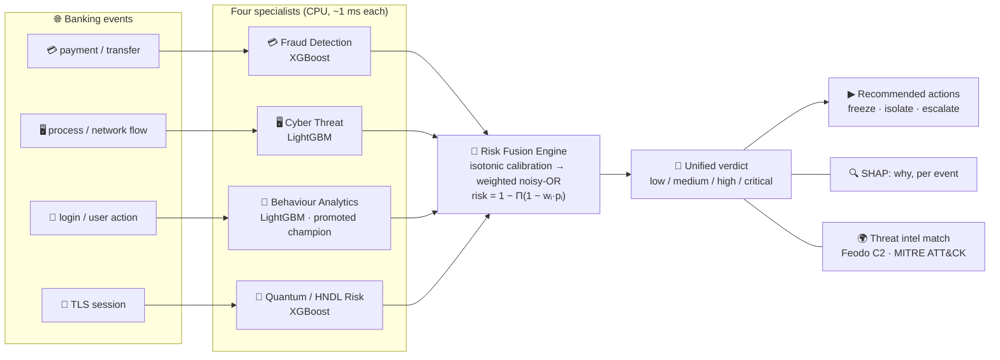
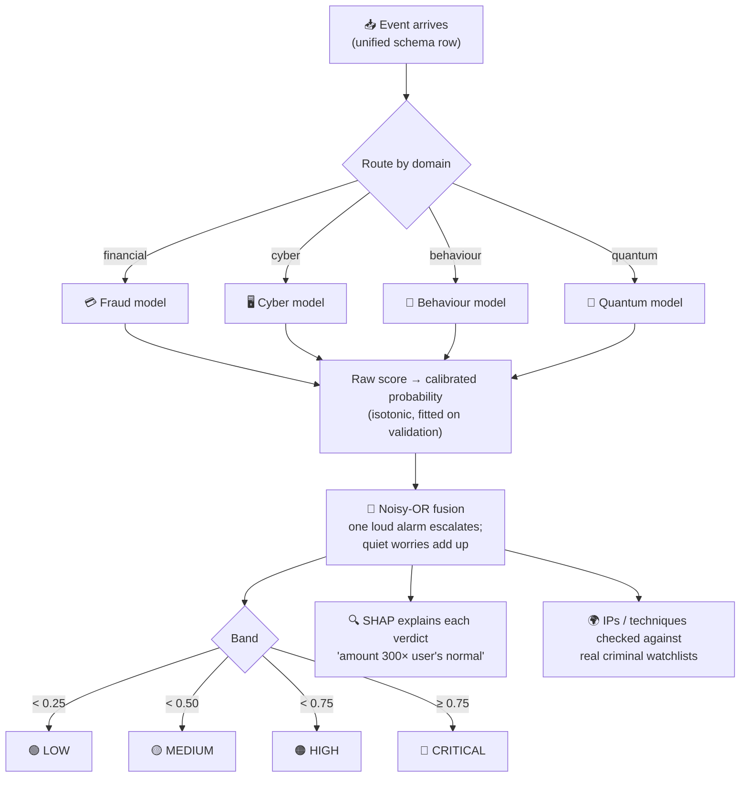
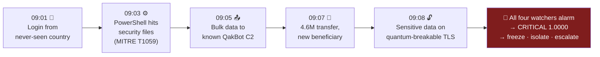
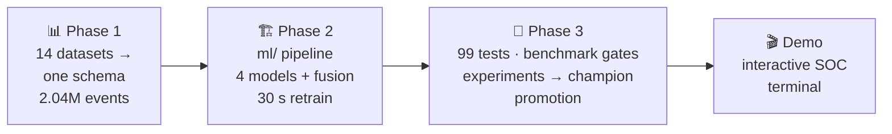
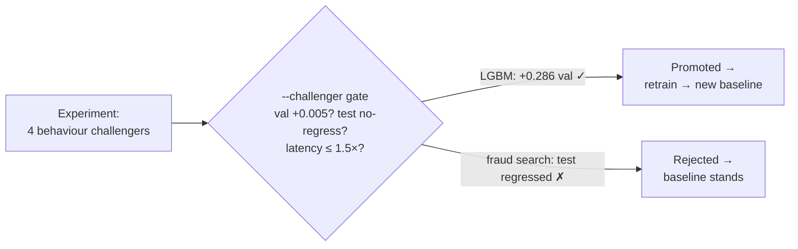

# 🛡️ Sentinel Fusion AI

**One AI brain that watches money, machines, people and the post-quantum future — and fuses what it sees into a single explainable threat verdict, in under 100 milliseconds.**

```bash
.venv/bin/python sentinel_demo.py     # ← the whole project, live in your terminal
```

---

## 1. Why we built it

Banks run **separate** defense teams. The fraud team sees a big transfer. The security team sees a strange program. The identity team sees an odd login. **Each alone looks minor — nobody sees the whole attack.**

Real attacks are chains: *steal a password → break into the machine → siphon data → move the money out.* By the time humans connect those dots across four dashboards, the money is gone.

And a new threat is already here: criminals **steal encrypted data today** to crack it with **quantum computers tomorrow** ("harvest now, decrypt later"). Almost nobody watches for it.

**Sentinel Fusion AI closes both gaps**: four specialist models watch the four fronts simultaneously, and a fusion engine combines their opinions into one verdict — with plain-language reasons for every decision.

## 2. What we built

Four trained specialists, one Command Center, full explainability, real threat-feed correlation — wrapped in an interactive terminal SOC experience.


```mermaid
flowchart LR
    subgraph EVENTS["🌐 Banking events"]
        E1["💳 payment / transfer"]
        E2["🖥️ process / network flow"]
        E3["👤 login / user action"]
        E4["🔐 TLS session"]
    end

    subgraph MODELS["Four specialists (CPU, ~1 ms each)"]
        M1["💳 Fraud Detection<br/>XGBoost"]
        M2["🖥️ Cyber Threat<br/>LightGBM"]
        M3["👤 Behaviour Analytics<br/>LightGBM · promoted champion"]
        M4["🔐 Quantum / HNDL Risk<br/>XGBoost"]
    end

    FUSE["🧠 Risk Fusion Engine<br/>isotonic calibration → weighted noisy-OR<br/>risk = 1 − Π(1 − wᵢ·pᵢ)"]
    OUT["🚨 Unified verdict<br/>low / medium / high / critical"]
    WHY["🔍 SHAP: why, per event"]
    TI["🌍 Threat intel match<br/>Feodo C2 · MITRE ATT&CK"]
    ACT["▶ Recommended actions<br/>freeze · isolate · escalate"]

    E1 --> M1 --> FUSE
    E2 --> M2 --> FUSE
    E3 --> M3 --> FUSE
    E4 --> M4 --> FUSE
    FUSE --> OUT --> ACT
    OUT --- WHY
    OUT --- TI
```

Trained on a **unified corpus of 2,043,664 events** built from **14 public datasets** across 5 domains (UNSW-NB15, BETH, CIC-IDS2017, credit-card fraud, PaySim, Bank Account Fraud, RBA logins, CERT insider, URLhaus, MITRE ATT&CK, CISA KEV, Feodo, malicious URLs, quantum-synthetic) — all mapped to **one event schema** so one pipeline trains everything.

## 3. How it works — one event, start to finish


```mermaid
flowchart TD
    A["📥 Event arrives<br/>(unified schema row)"] --> B{"Route by domain"}
    B -->|financial| C1["💳 Fraud model"]
    B -->|cyber| C2["🖥️ Cyber model"]
    B -->|behaviour| C3["👤 Behaviour model"]
    B -->|quantum| C4["🔐 Quantum model"]
    C1 & C2 & C3 & C4 --> D["Raw score → calibrated probability<br/>(isotonic, fitted on validation)"]
    D --> E["🧠 Noisy-OR fusion<br/>one loud alarm escalates;<br/>quiet worries add up"]
    E --> F{"Band"}
    F -->|"< 0.25"| G1["🟢 LOW"]
    F -->|"< 0.50"| G2["🟡 MEDIUM"]
    F -->|"< 0.75"| G3["🟠 HIGH"]
    F -->|"≥ 0.75"| G4["🔴 CRITICAL"]
    E --> H["🔍 SHAP explains each verdict<br/>'amount 300× user's normal'"]
    E --> I["🌍 IPs / techniques checked against<br/>real criminal watchlists"]
```

The demo plays this on a real attack chain — every prediction from the trained models, nothing staged:


```mermaid
flowchart LR
    T1["09:01 🔑<br/>Login from<br/>never-seen country"] --> T2["09:03 ⚙️<br/>PowerShell hits<br/>security files<br/>(MITRE T1059)"] --> T3["09:05 📤<br/>Bulk data to<br/>known QakBot C2"] --> T4["09:07 💸<br/>4.6M transfer,<br/>new beneficiary"] --> T5["09:08 🔓<br/>Sensitive data on<br/>quantum-breakable TLS"]
    T5 --> V["🧠 All four watchers alarm<br/>→ CRITICAL 1.0000<br/>→ freeze · isolate · escalate"]
    style V fill:#7f1d1d,color:#fff
```

Contrast case ships too: a routine card payment → **LOW 0.0008, no watchlist match** — the AI stays quiet when nothing is wrong.

## 4. How we built it — the journey


```mermaid
flowchart LR
    P1["📊 Phase 1<br/>14 datasets →<br/>one schema<br/>2.04M events"] --> P2["🏗️ Phase 2<br/>ml/ pipeline<br/>4 models + fusion<br/>30 s retrain"] --> P3["🧪 Phase 3<br/>99 tests · benchmark gates<br/>experiments → champion<br/>promotion"] --> P4["🎬 Demo<br/>interactive SOC<br/>terminal"]
```

**Phase 1 — data.** Cleaned 14 raw datasets, mapped everything onto one event schema (`docs/unified_schema.md`), engineered **leakage-safe, past-only features** (every historical aggregate excludes the current row), validated the 2.04M-row corpus.

**Phase 2 — models.** Modular `ml/` package (config / data / features / train / evaluate / explain / fusion). **Per-source temporal split** 70/15/15 — models are always tested on events from *after* their training window, per dataset. Serialized both joblib bundles and pickle-free native boosters, with score-parity tests between them. Full retrain: **~30 seconds** on a laptop CPU.

**Phase 3 — prove it, then improve it.**
- **99-test pytest suite**: unit math checks (fusion noisy-OR closed-form, band boundaries), leakage guards, model-quality floors, serialization round-trips, latency SLAs — running on a committed 1.4 MB data fixture.
- **Benchmark harness with a regression gate**: `python -m ml.benchmark --check` fails the build if any metric drops below the committed baseline.
- **Bounded experiments with gated promotion** — no cherry-picking; challengers must beat the champion on validation AND test AND latency:


```mermaid
flowchart LR
    EXP["Experiment:<br/>4 behaviour challengers"] --> GATE{"--challenger gate<br/>val +0.005? test no-regress?<br/>latency ≤ 1.5×?"}
    GATE -->|"LGBM: +0.286 val ✓"| PROMOTE["Promoted →<br/>retrain → new baseline"]
    GATE -->|"fraud search: test regressed ✗"| KEEP["Rejected →<br/>baseline stands"]
```

**Honest wins and honest losses:**
- 🏆 Behaviour model **0.584 → 0.817 ROC-AUC** (supervised LightGBM beat IsolationForest, LOF, ECOD) → fusion rose **0.958 → 0.972**.
- ❌ Fraud 24-config search **lost on test** (PR-AUC 0.526 < 0.536) — rejected, documented, baseline kept.
- 🐛 Caught our own leak: `event_subtype` carried the attack-category name for two datasets → cyber scored a fake 1.000. Scrubbed at load, pinned by tests. `severity` (label-derived) excluded everywhere.

## 5. Comprehensive Model Benchmarks & Performance Summary

Every model is evaluated on unseen test events using per-source temporal splitting (70% train / 15% val / 15% test) to prevent future-data leakage. Thresholds are selected via max-F1 on validation. Reproduce with `python -m ml.benchmark`. Baseline floors are strictly enforced in `benchmarks/baselines/metrics_baseline.json`.

| Model Key | Specialist Role | Algorithm / Library | Train / Val / Test Rows | Pos Rate | ROC-AUC | PR-AUC | F1 | Precision | Recall | Accuracy | Single-Row p50 | Batch Throughput |
|---|---|---|---:|---:|---:|---:|---:|---:|---:|---:|---:|---:|
| `fraud_payment` | 💳 Payment Fraud | XGBoost (`hist`) | 1.34M / 286K / 286K | 0.58% | **0.9981** | **0.8897** | **0.8314** | 0.8629 | 0.8021 | 0.9989 | 2.50 ms | 1.82 M rows/s |
| `fraud_application` | 📝 Account Opening | XGBoost (`hist`) | 112K / 24K / 24K | 6.30% | **0.7927** | **0.3469** | **0.3814** | 0.3575 | 0.4086 | 0.8827 | 1.45 ms | 3.57 M rows/s |
| `cyber` | 🖥️ Cyber Threat | LightGBM | 416K / 89K / 89K | 71.11% | **0.9975** | **0.9960** | **0.9620** | 0.9597 | 0.9643 | 0.9706 | 0.79 ms | 1.78 M rows/s |
| `behaviour` | 👤 UEBA & Logins | LightGBM (Supervised) | 210K / 45K / 45K | 48.64% | **0.7033** | **0.7144** | **0.7476** | 0.6310 | 0.9168 | 0.6567 | 0.72 ms | 7.08 M rows/s |
| `quantum` | 🔐 PQC / HNDL Risk | XGBoost (`hist`) | 108K / 23K / 23K | 3.49% | **1.0000** | **0.9999** | **0.9958** | 0.9916 | 1.0000 | 0.9997 | 1.41 ms | 2.83 M rows/s |
| **`fusion`** | 🧠 **Risk Fusion** | Isotonic + Noisy-OR | 498,726 fused events | — | **0.9890** | — | — | — | — | — | <0.01 ms | 332K–955K/s |

---

## 6. Detailed Model Specifications, Parameters & Deep Dives

### 6.1 💳 Fraud Detection — Payment Path (`fraud_payment`)

* **Domain & Role**: Financial Payment Fraud (card transactions, bank transfers, online checkout).
* **Routing**: Triggered when `event_domain == "financial"` and `event_type != "account_open"`.
* **Training Datasets**: `sparkov` (999 credit cards, median 1,471 transactions/card, CC0) + `finspark` / `finspark_synth` (scaffolding bank export with complete customer transaction sequences and label confirmation timestamps). `paysim` dropped due to artificial balance-zeroing leak; `creditcard` dropped due to non-servable PCA features.
* **Corpus Split**: 1,336,069 Train rows | 286,273 Val rows | 286,170 Test rows. Training positive rate: **0.58%**.
* **Algorithm & Hyperparameters**:
  ```python
  XGBClassifier(
      n_estimators=400,          # Best iteration: 124 (early stopped)
      learning_rate=0.1,
      max_depth=6,
      min_child_weight=5,
      subsample=0.8,
      colsample_bytree=0.8,
      tree_method="hist",
      eval_metric="aucpr",
      early_stopping_rounds=30,
      random_state=42,
  )
  ```
* **Feature Contract (35 Features)**:
  * *Numeric (29)*: `amount`, `f_log1p_amount`, `f_amount_z_user`, `f_amount_ratio_mean`, `balance_before`, `balance_after`, `counterparty_balance_before`, `counterparty_balance_after`, `f_balance_drain_ratio`, `f_amount_vs_balance`, `f_balance_inconsistent`, `counterparty_age_s`, `counterparty_is_new`, `name_mismatch`, `f_counterparty_new`, `f_user_distinct_counterparties`, `f_merchant_category_novel`, `f_user_txn_count_1h`, `f_geo_distance_km`, `customer_age`, `account_age_s`, `device_is_new`, `is_foreign_request`, `is_credit`, `f_user_seq_no`, `f_user_secs_since_last`, `f_user_new_country`, `f_hour`, `f_dayofweek`, `f_is_weekend`, `f_is_night`, `f_hour_sin`, `f_hour_cos`, `bank_txn_count_1h`, `bank_amount_vs_user_mean`, `bank_beneficiary_age_s`, `bank_is_new_beneficiary`.
  * *Categorical (6)*: `payment_type`, `channel`, `merchant_category`, `currency`, `country`, `counterparty_country`.
* **Servability & Leak Guards**:
  * `f_user_past_malicious_rate` excluded (`USER_F_SERVABLE`) because online `/feedback` is empty on day one; keeping it caused model to score real fraud as benign (0.0001) due to rate=0 shift.
  * `severity` excluded everywhere (label-derived).
* **Validation Threshold**: **0.92285** (max-F1) or **0.764** under population-cost analysis ($c_{\text{fn}} = 20 \cdot c_{\text{fp}}$).
* **Top SHAP Explainability Drivers**:
  1. `amount` (|SHAP| = 2.409) — Absolute transaction monetary value.
  2. `merchant_category` (|SHAP| = 1.036) — High-risk or unusual merchant category.
  3. `f_user_distinct_counterparties` (|SHAP| = 0.783) — Rapid fan-out to unseen beneficiaries.
  4. `f_hour_cos` (|SHAP| = 0.740) — Off-hours / late-night transaction timing.
  5. `f_log1p_amount` (|SHAP| = 0.720) — Log-scaled transaction magnitude.
  6. `f_amount_ratio_mean` (|SHAP| = 0.442) — Multiple of customer's historical average spend.

---

### 6.2 📝 Fraud Detection — Application Path (`fraud_application`)

* **Domain & Role**: Account Opening & Synthetic Identity Fraud.
* **Routing**: Triggered when `event_domain == "financial"` and `event_type == "account_open"`.
* **Training Datasets**: `baf` (Bank Account Fraud dataset across 6 synthetic fraud variants).
* **Corpus Split**: 112,560 Train rows | 24,120 Val rows | 24,120 Test rows. Training positive rate: **6.30%**.
* **Algorithm & Hyperparameters**:
  ```python
  XGBClassifier(
      n_estimators=400,          # Best iteration: 56 (early stopped)
      learning_rate=0.1,
      max_depth=6,
      min_child_weight=5,
      subsample=0.8,
      colsample_bytree=0.8,
      tree_method="hist",
      eval_metric="aucpr",
      early_stopping_rounds=30,
      random_state=42,
  )
  ```
* **Feature Contract (18 Features)**:
  * *Numeric (15)*: `amount`, `f_log1p_amount`, `duration_s`, `session_length_s`, `income`, `customer_age`, `account_age_s`, `email_is_free`, `is_foreign_request`, `f_hour`, `f_dayofweek`, `f_is_weekend`, `f_is_night`, `f_hour_sin`, `f_hour_cos`.
  * *Categorical (3)*: `channel`, `device_os`, `country`.
* **Validation Threshold**: **0.7027** (max-F1 on validation split).
* **Top SHAP Explainability Drivers**:
  1. `device_os` (|SHAP| = 0.622) — Operating system distribution anomaly.
  2. `account_age_s` (|SHAP| = 0.373) — Instant application upon account initialization.
  3. `customer_age` (|SHAP| = 0.327) — Age group and demographic vulnerability bracket.
  4. `income` (|SHAP| = 0.317) — Income level mismatch relative to requested credit line.
  5. `email_is_free` (|SHAP| = 0.295) — Free/disposable webmail provider domain.

---

### 6.3 🖥️ Cyber Threat Detection (`cyber`)

* **Domain & Role**: Network & Host Security, Intrusion Detection, Malware C2 & Exfiltration.
* **Routing**: Triggered when `event_domain == "cyber"`.
* **Training Datasets**: `unsw_nb15` (network attacks) + `beth` (kernel syscall & host process logs) + `cicids2017` (IDS flow traffic).
* **Corpus Split**: 416,404 Train rows | 89,230 Val rows | 89,231 Test rows. Training positive rate: **71.11%**.
* **Algorithm & Hyperparameters**:
  ```python
  LGBMClassifier(
      n_estimators=500,          # Best iteration: 208
      learning_rate=0.1,
      num_leaves=63,
      min_child_samples=50,
      subsample=0.8,
      subsample_freq=1,
      colsample_bytree=0.8,
      objective="binary",
      random_state=42,
      verbosity=-1,
  )
  ```
* **Feature Contract (20 Features)**:
  * *Numeric (17)*: `duration_s`, `bytes_in`, `bytes_out`, `f_log1p_bytes_in`, `f_log1p_bytes_out`, `f_bytes_ratio`, `src_port`, `dst_port`, `f_user_seq_no`, `f_user_secs_since_last`, `f_user_past_malicious_rate`, `f_user_new_country`, `f_device_seq_no`, `f_device_past_hisev_count`, `f_hour`, `f_dayofweek`, `f_is_weekend`, `f_is_night`, `f_hour_sin`, `f_hour_cos`.
  * *Categorical (3)*: `event_type`, `event_subtype`, `protocol`.
* **Leakage Guards & Freeze**:
  * `event_subtype` nulled for `unsw_nb15` & `cicids2017` because raw dataset embedded target names into subtype.
  * Model is strictly **frozen** across pipeline rebuilds to maintain deterministic baseline guarantees.
* **Validation Threshold**: **0.2920** (max-F1 on validation split).
* **Top SHAP Explainability Drivers**:
  1. `f_device_past_hisev_count` (|SHAP| = 6.083) — Device historical high-severity incident tally.
  2. `dst_port` (|SHAP| = 2.838) — Target destination port (e.g. non-standard administrative/C2 ports).
  3. `duration_s` (|SHAP| = 0.897) — Connection duration anomaly.
  4. `f_device_seq_no` (|SHAP| = 0.774) — Event sequence velocity per device.
  5. `f_bytes_ratio` (|SHAP| = 0.670) — Asymmetric upload/download exfiltration ratio.

---

### 6.4 👤 Behaviour Analytics — UEBA (`behaviour`)

* **Domain & Role**: User & Entity Behaviour Analytics (UEBA), Account Takeover (ATO), Login Anomaly Detection.
* **Routing**: Triggered when `event_domain == "behaviour"`.
* **Training Datasets**: `rba` (Risk-Based Authentication dataset with verified customer login labels) + `cert_insider` (unlabeled scoring).
* **Corpus Split**: 210,453 Train rows | 45,097 Val rows | 45,098 Test rows. Training positive rate: **48.64%**.
* **Algorithm & Hyperparameters**:
  ```python
  LGBMClassifier(                # Promoted from IsolationForest (Phase 3 challenger gate: val AUC +0.286)
      n_estimators=500,          # Best iteration: 21
      learning_rate=0.1,
      num_leaves=63,
      min_child_samples=50,
      subsample=0.8,
      subsample_freq=1,
      colsample_bytree=0.8,
      objective="binary",
      random_state=42,
      verbosity=-1,
  )
  ```
* **Feature Contract (13 Features)**:
  * *Numeric (11)*: `duration_s`, `f_user_seq_no`, `f_user_secs_since_last`, `f_user_new_country`, `f_device_seq_no`, `f_hour`, `f_dayofweek`, `f_is_weekend`, `f_is_night`, `f_hour_sin`, `f_hour_cos`.
  * *Categorical (2)*: `event_type`, `event_subtype`.
* **Design Rationale**:
  * `country` feature removed deliberately (was #1 SHAP feature in raw RBA due to corpus artifact: 78% fraud in US vs 10% in NO). Removing it prevents synthetic geographical bias and enables real-world cross-border generalization.
* **Validation Threshold**: **0.4888** (max-F1 on validation split).
* **Top SHAP Explainability Drivers**:
  1. `f_device_seq_no` (|SHAP| = 0.510) — Device activity sequence number.
  2. `f_user_secs_since_last` (|SHAP| = 0.207) — Elapsed time since user's previous action (impossible travel / burst logins).
  3. `f_user_seq_no` (|SHAP| = 0.206) — Cumulative user event count.
  4. `event_subtype` (|SHAP| = 0.168) — Action subtype (e.g. credential modification vs profile view).
  5. `f_hour` (|SHAP| = 0.135) — Access hour relative to user's diurnal pattern.

---

### 6.5 🔐 Quantum / HNDL Risk (`quantum`)

* **Domain & Role**: Post-Quantum Cryptography (PQC) & Harvest-Now-Decrypt-Later (HNDL) Vulnerability.
* **Routing**: Triggered when `event_domain == "quantum"`.
* **Training Datasets**: `quantum_synth` (Synthetic quantum traffic dataset join-enriched with native certificate attributes).
* **Corpus Split**: 108,827 Train rows | 23,320 Val rows | 23,321 Test rows. Training positive rate: **3.49%**.
* **Algorithm & Hyperparameters**:
  ```python
  XGBClassifier(
      n_estimators=400,          # Best iteration: 119
      learning_rate=0.1,
      max_depth=6,
      min_child_weight=5,
      subsample=0.8,
      colsample_bytree=0.8,
      tree_method="hist",
      eval_metric="aucpr",
      random_state=42,
  )
  ```
* **Feature Contract (16 Features)**:
  * *Numeric (11)*: `bytes_out`, `f_log1p_bytes_out`, `f_device_seq_no`, `q_cert_age_days`, `q_cert_validity_days`, `f_hour`, `f_dayofweek`, `f_is_weekend`, `f_is_night`, `f_hour_sin`, `f_hour_cos`.
  * *Categorical (5)*: `event_subtype`, `country`, `q_key_exchange`, `q_cert_key_type`, `q_data_class`.
* **Validation Threshold**: **0.9641** (scores are sharply bimodal 0.0 or ~0.90+).
* **Top SHAP Explainability Drivers**:
  1. `q_data_class` (|SHAP| = 4.240) — Data sensitivity classification (e.g., PII/PCI-DSS vs public).
  2. `q_cert_key_type` (|SHAP| = 2.281) — Cryptographic key algorithm (RSA-2048 / ECC vs Post-Quantum ML-KEM).
  3. `bytes_out` (|SHAP| = 2.269) — Data payload volume (exfiltration scale).
  4. `event_subtype` (|SHAP| = 1.486) — Session protocol subtype.
  5. `q_key_exchange` (|SHAP| = 0.736) — Key exchange vulnerability.

---

### 6.6 🧠 Risk Fusion Engine (`fusion`)

The Risk Fusion Engine transforms individual domain assessments into a unified threat verdict using a two-stage mathematical pipeline:

1. **Isotonic Calibration**: Each specialist model's raw score is mapped onto a true probability $P_i = P(\text{threat} \mid \mathbf{x}_i)$ via isotonic regression fitted on validation splits.
2. **Weighted Noisy-OR Aggregation**: Multi-domain risks are combined using an asynchronous noisy-OR formula:
   $$\text{Risk} = 1 - \prod_{i \in \text{active}} \Big(1 - w_i \cdot P_i\Big)$$
   * **Domain Weights ($w_i$)**:
     * `fraud_payment`: **1.0**
     * `fraud_application`: **1.0**
     * `cyber`: **1.0**
     * `quantum`: **0.9**
     * `behaviour`: **0.7** (lower prior due to unsupervised/heterogeneous baseline history)
3. **Fitted Risk Bands**: Rather than arbitrary static cutoffs (e.g. 0.25/0.50/0.75), band boundaries are fitted on validation fused risk using business-cost ratios ($c_{\text{fn}}/c_{\text{fp}}$: Medium=60, High=20, Critical=5):
   * 🟢 **LOW**: Routine background traffic (cost-optimal for low risk).
   * 🟡 **MEDIUM**: Elevated concern ($c_{\text{fn}}/c_{\text{fp}} = 60$).
   * 🟠 **HIGH**: Strong threat indicator ($c_{\text{fn}}/c_{\text{fp}} = 20$).
   * 🔴 **CRITICAL**: Immediate action required ($c_{\text{fn}}/c_{\text{fp}} = 5$ or risk score $\ge 0.75$).

* **Fusion Performance**:
  * Cross-domain ROC-AUC: **0.9890** (evaluated on 498,726 fused test events).
  * Batch Throughput: **332,000 to 955,000 fused events/sec**.

---

### 6.7 Hardware & Deployment Requirements

| Resource | Full Retraining Pipeline | Online SOC Scoring & Demo |
|---|---|---|
| **CPU** | Any x86-64 / ARM64 (4+ cores recommended) | Any single core suffices |
| **GPU** | **None needed** (CPU-native histogram algorithms) | **None needed** |
| **RAM** | ~2.0 GB peak (2.04M rows, column-pruned Parquet) | ~0.5 GB (incl. live SHAP + Threat Intel DB) |
| **Disk Storage** | ~2.6 GB unified Parquet + <5 MB model artifacts | <5 MB trained bundles + native boosters |
| **Execution Time** | **~30 seconds** full retrain (12-core laptop) | **~1.5 ms** single event, **~90 ms** 5-event incident with SHAP |

### 6.8 Software Stack & Artifact Serialization

* **Software Dependencies** (Pinned in `requirements.txt`):
  * **Python 3.12** runtime
  * **XGBoost 3.3.0** (`fraud_payment`, `fraud_application`, `quantum`)
  * **LightGBM 4.6.0** (`cyber`, `behaviour`)
  * **scikit-learn 1.9.0** (Isotonic regression calibration & metrics)
  * **SHAP 0.52.0** (Live TreeExplainer feature attribution)
  * **pyarrow 25.0 / pandas 3.0.3 / numpy 2.4.6** (High-throughput Parquet data pipeline)
  * **rich 15.0** (Interactive SOC terminal UI)

* **Artifact Formats**:
  1. **Joblib Bundles** (`models/<key>_bundle.joblib`): Self-contained inference bundles containing model weights, feature ordering, categorical encodings, median imputation values, fitted validation thresholds, and contract fingerprint hashes (`CONTRACT_HASH`).
  2. **Native Pickle-Free Boosters** (`models/*.json`, `models/*.txt`): Portable C++ native booster files (`fraud_xgb.json`, `quantum_xgb.json`, `cyber_lgbm.txt`, `behaviour_lgbm.txt`) that score byte-identically to joblib bundles (parity-tested to $1 \times 10^{-6}$).


## 7. 🎬 The demo — what judges see

Interactive menu, plain language, zero jargon required:

```
What would you like to see?
 1  🚨  Watch a live attack get caught
 2  ✅  Watch a normal customer sail through
 3  🧠  Meet the AI team — who watches what
 4  🔍  Step through the attack, one event at a time
 5  📊  Report card — how good is this AI really?
 6  🚪  Exit
```

- **1 / 2** — the full SOC story auto-played: loading, incoming events, feature extraction, model routing, fusion diagram, SHAP explanations, threat-intel matches, attack timeline, incident report, performance metrics.
- **3** — the models as plain-language specialists: Money Watcher 💳, Intrusion Watcher 🖥️, Habits Watcher 👤, Future-Proofing Watcher 🔐, and the Command Center 🧠.
- **4** — presenter mode: press Enter to advance event by event; each shows *what happened*, a 0–100 suspicion meter, the verdict, decision time, and **why in human sentences** ("This transfer is far outside this customer's normal range", "destination = known QakBot criminal server").
- **5** — quality as a plain report card ("catches 97 of every 100 real cases"), read from the saved test metrics.

Honesty contract: event data is simulated **from real labeled test rows** (`demo/build_scenarios.py`); every probability, SHAP value and watchlist hit is computed live by the trained artifacts. Predictions are never faked.

Classic non-interactive runs (recordings/CI): `--all`, `--scenario attack|benign`, `--fast`, `--no-color`.

## 8. Setup & commands

```bash
python3.12 -m venv .venv
source .venv/bin/activate
pip install -r requirements.txt      # or: pip install -e .[train,dev]
```

The demo needs `models/` (regenerates in ~30 s, below) and `demo/scenarios.parquet` (committed). Full retraining needs `data/unified/*.parquet` from Phase 1.

```bash
.venv/bin/python sentinel_demo.py              # the demo (interactive menu)
.venv/bin/python -m ml.run_pipeline            # retrain all 4 models + fusion (~30 s)
.venv/bin/pytest                               # fast tier: 59 tests, <5 s, no big data
.venv/bin/pytest -m ""                         # everything incl. slow/quality/perf (99 tests)
.venv/bin/python -m ml.benchmark               # measure + append history
.venv/bin/python -m ml.benchmark --check       # regression gate (exit 1 on breach)
.venv/bin/python -m ml.benchmark --challenger models/challengers/X.joblib --model KEY
make test | test-all | gates | bench | experiments | lint   # shortcuts
```

## 9. Repo layout

```
ml/               training pipeline + benchmark + experiments
demo/             SOC demo: engine, plain-language layer, interactive menu, scenarios
sentinel_demo.py  demo entry point
tests/            99-test suite (unit/integration/quality/perf) + committed mini fixture
benchmarks/       committed baseline floors + run history (JSONL)
models/           trained bundles + native boosters (gitignored, regenerate in ~30 s)
reports/ml/       metrics, SHAP plots, fusion report, experiments, MODELS.md
data/, notebooks/, docs/, reports/   Phase 1 (below)
```

## 10. Phase 1 — dataset collection & preprocessing

```
data/raw/         raw downloads (gitignored): cyber, financial, behaviour, threat_intel
data/clean/       cleaned per-dataset parquet
data/unified/     part_*.parquet + unified_events.parquet + unified_events_engineered.parquet
notebooks/        01-13 preprocessing/unify/features/validation notebooks
notebooks/src/    percent-format sources (python notebooks/_make_nb.py regenerates .ipynb)
docs/             unified_schema.md, data_dictionary.md
reports/          per-dataset stats, EDA figures, validation_report.{json,md}
```

Run order: 01→10 (any order, independent), then 11_unify → 12_feature_engineering → 13_validation_report.

Re-download raw data: `bash` the Kaggle slugs in `docs/data_dictionary.md` (creds via `.env`: `KAGGLE_USERNAME=...` / `KAGGLE_TOKEN=...`).
